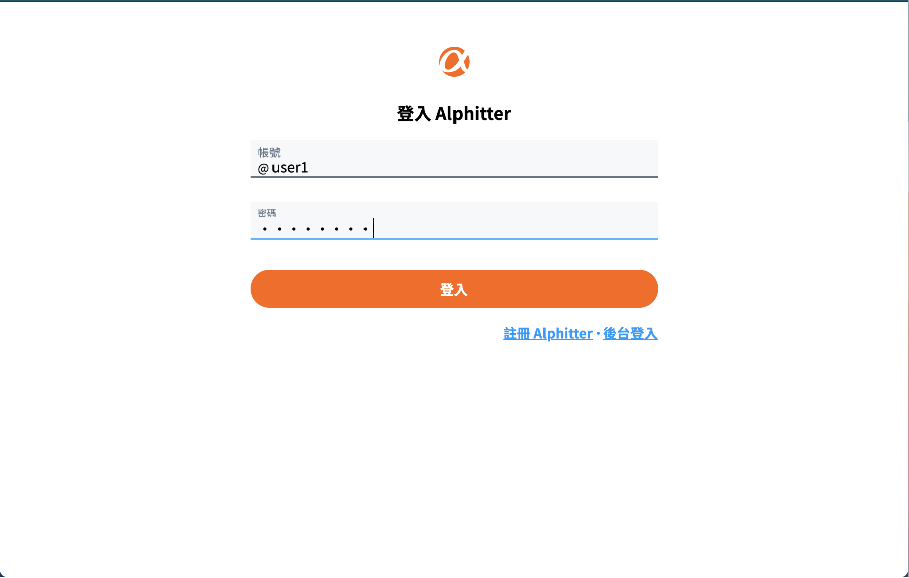

# simple-twitter-frontend
專案網址：https://tzynwang.github.io/simple-twitter-frontend/

## 功能介紹
- 可在首頁瀏覽全部推文
- 可在任意頁面開啟新增推文之對話框，執行新增推文
- 在大多數畫面皆支援執行回覆推文、對推文按讚的行為
- 使用者可修改自身名稱、封面圖片、大頭照、自我介紹，以及帳號相關設定

## 測試帳號
- 帳號（五選一）：`user1`、`user2`、`user3`、`user4`、`user5`
- 密碼：一律為`12345678`

## 開發人員
以英文字母順序排列：
- （後端）[Alicia (JHIHLEI LIN)](https://github.com/JHIH-LEI)
- （前端）[Charlie (Tzu Yin)](https://github.com/tzynwang)
- （前端）[Raven](https://github.com/ravenera0317)
- （後端）Whaleep
